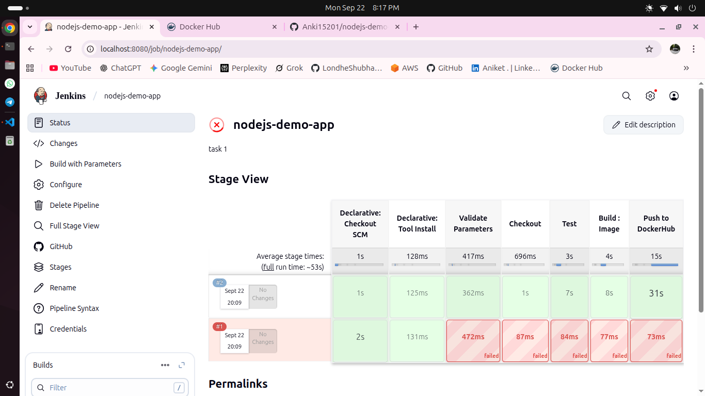
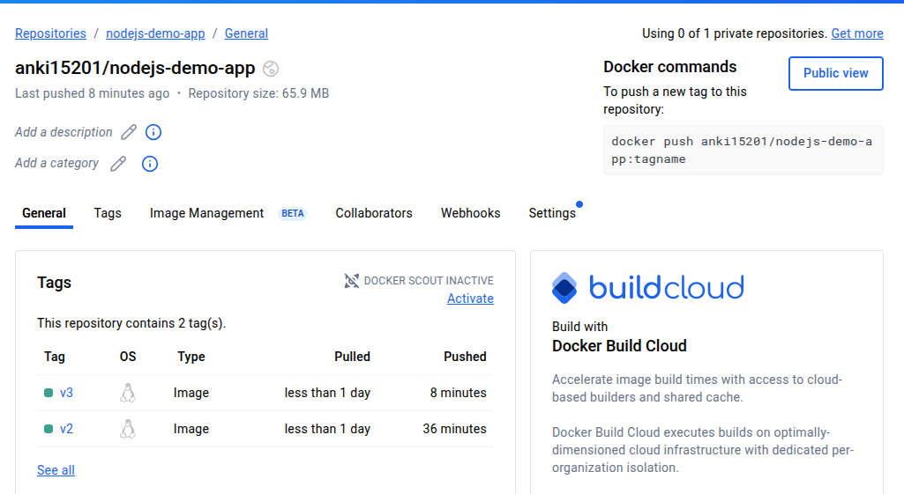

Jenkins Pipeline for Node.js Demo App

This repository contains a Jenkins pipeline configuration to automate the build, test, and deployment of a Node.js demo application to Docker Hub. Below are the detailed steps to set up and run the pipeline.

Prerequisites

Jenkins server installed and configured.

Node.js installed and configured in Jenkins (e.g., named 'NodeJS' in Global Tool Configuration).

Docker installed on the Jenkins agent.

Docker Hub credentials stored in Jenkins (e.g., with ID 'dockerhubcred').

Git repository cloned and accessible.

Pipeline Overview

The pipeline is defined in the Jenkinsfile and includes the following stages:

Validate Parameters: Ensures the IMAGE_TAG parameter is provided.

Checkout: Checks out the source code from the repository.

Test: Installs dependencies and runs tests using npm.

Build : Image: Builds a Docker image with the specified tag.

Push to DockerHub: Pushes the built image to Docker Hub.

Steps to Set Up and Run the Pipeline

1. Configure Jenkins

Ensure Jenkins is running and accessible.

Install the necessary plugins (e.g., NodeJS Plugin, Docker Pipeline Plugin).

Configure Node.js in Manage Jenkins > Global Tool Configuration with the name 'NodeJS'.

Add Docker Hub credentials in Manage Jenkins > Manage Credentials with ID 'dockerhubcred'.

2. Clone the Repository

Clone this repository to your local machine or Jenkins workspace:

git clone https://github.com/Anki15201/nodejs-demo-app.git

Push the changes to your remote repository if not already done.

3. Create a Jenkins Pipeline Job

In Jenkins, create a new Pipeline job.

Select "Pipeline script from SCM" and configure the SCM to point to this repository.

Set the Jenkinsfile as the script path.

Save the job configuration.

4. Run the Pipeline

Trigger the pipeline manually or via a webhook.

Provide an IMAGE_TAG value (e.g., v1.0.0) when prompted.

Monitor the build progress in the Jenkins UI.

5. Verify the Pipeline

Check the console output for each stage.

Ensure the Docker image is built and pushed to Docker Hub under the repository anki15201/nodejs-demo-app.

Screenshot of Working Pipeline

Note

I used code from someone else and only made some changes to adapt it to my needs.

Troubleshooting

If the pipeline fails at the "Test" stage, ensure npm test is defined in your package.json.

If the "Push to DockerHub" stage fails, verify the Docker Hub credentials and network connectivity.

License

This project is licensed under the Apache-2.0 License. See the LICENSE file for details.
